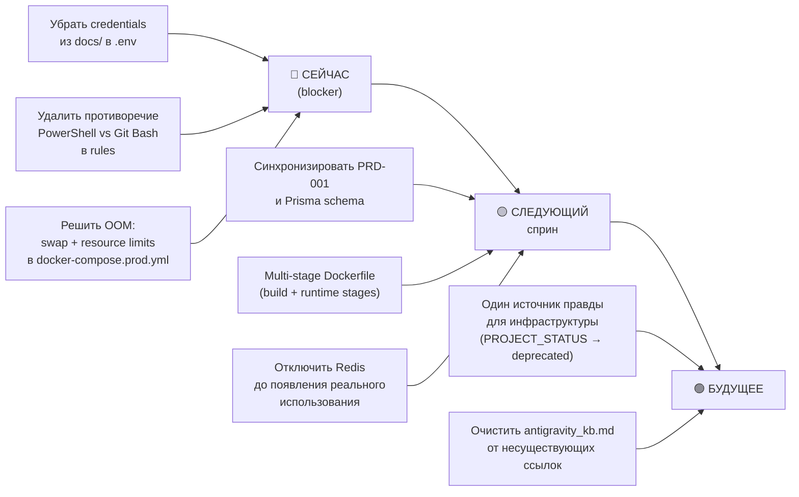

# CTO Архитектурный Анализ: Проект UPGRADE

> **Роль:** CTO-архитектор, внешний взгляд  
> **Дата анализа:** 2026-02-20  
> **Статус:** Только анализ. Никаких изменений в документы не вносилось.

---

## Executive Summary

Проект **UPGRADE** — это B2B SaaS инструмент для управления деловой программой конференций (Business Program Editor). Стек: NestJS + PostgreSQL (Prisma) + React/Vite/AntD Pro. Деплой через Docker + GitHub Actions на VPS.

**Общий вердикт:** Продукт имеет хорошо продуманную доменную модель и правильный технологический выбор. Однако существуют **системные проблемы** с документацией, инфраструктурой и приоритизацией, которые уже создали и продолжат создавать технический долг.

---

## 🔴 Критические проблемы

### 1. Документация живёт отдельно от реальности

Это главная проблема проекта. Зафиксировано как минимум **3 параллельных источника правды:**

| Источник | Что говорит |
|---|---|
| `docs/prd/06_Infrastructure_and_Release.md` | Папки `/backend/`, `/infra/` существуют в структуре |
| `docs/prd/00_Preflight_Checklist.md` | Структура `/backend`, `/frontend`, `/infra`, `/.antigravity` — описывает то, чего нет |
| `.antigravity/PROJECT_STATUS.md` | **"INFRA: DOES NOT EXIST. Все конфиги в ROOT"** |

**Итог:** PRD-006 (`Infra file structure`) описывает несуществующие папки. PRD-000 (`Preflight Checklist`) содержит структуру из старого плана. `PROJECT_STATUS.md` противоречит обоим. Агент без понимания контекста гарантированно сделает ошибку.

> [!WARNING]
> В `docs/prd/00_Preflight_Checklist.md` (строки 91–121) дословно скопирован YAML-конфиг из `project_skills.yml` — включая **production credentials** (login + password от `sales.upgradecrm.ru`) в открытом тексте. Это **security-дыра** в документации.

---

### 2. Инфраструктурный хаос как следствие реактивного управления

`PROJECT_STATUS.md` показывает историю deployment'а как цепочку кризисов:
- OOM Kill (Exit Code 137) — **нерешён** на момент последнего обновления.
- Сервер — **1 CPU VPS с 1 GB RAM**, на котором надо одновременно запустить: PostgreSQL, Redis, NestJS, Frontend-контейнер с Nginx, плюс `prisma db seed` при деплое. **Это физически невозможно без swap.**
- В `docker-compose.prod.yml` нет **resource limits** ни для одного контейнера.
- `Dockerfile` — не multi-stage. Образ тянет все `node_modules` (включая devDependencies) в production.

**PRD-006** декларирует `Min RAM: 4 GB`. Факт: сервер имеет значительно меньше, судя по OOM. Это расхождение ТЗ с реальностью никто не закрыл документально.

---

### 3. Дублирование правил в двух местах

`project_rules.yaml` и `.antigravityrules` — **почти идентичны.** В `project_rules.yaml` обнаружен дубль правила:

```yaml
# строки 51–53 — полная копия строк 47–49
- id: "cli-non-interactive"  # ДУБЛЬ
  description: "Never use interactive CLI commands..."
  severity: "error"
```

При этом `project_rules.yaml` содержит правило `shell-safe-execution` (строки 96–102) с PowerShell-инструкциями (`Select-String`, `$env:VAR`), которое **противоречит** финальной строке `.antigravityrules`: *"Switched to Git Bash. Strict PowerShell blocking rules are no longer needed."* Агент получает противоречивые сигналы.

---

## 🟡 Архитектурные расхождения

### 4. Схема данных в PRD-001 расходится с реальной Prisma-схемой

**PRD-001** описывает `Session` с полями `manager_comment`, `program_thesis`, `newsletter_quote` — эти поля на самом деле находятся в `SessionSpeaker`. Это нормальная эволюция, но PRD-001 не обновлён и вводит в заблуждение.

**PRD-001** описывает `SessionSpeaker` без поля `emailSnapshot`, хотя **PRD-008** его добавляет. В реальной Prisma-схеме `emailSnapshot` **отсутствует**. PRD-008 опережает реализацию, PRD-001 отстаёт — консистентности нет.

**User model** в PRD-007 описывает переход на `email`-based авторизацию и добавление `is_super_admin`. В реальной Prisma-схеме: `username` (не email), нет `is_super_admin`, нет `is_active`. PRD-007 — это Design Doc для будущего, а не описание текущего состояния.

### 5. Иерархия данных Track — архитектурная излишность для MVP

Текущая иерархия: `Event → Hall → Track → Session`.

**Проблема:** `Track` — это промежуточный уровень группировки сессий внутри зала. В реальном use case организатора (судя по анализу legacy-системы и Excel-файлу в references) **большинство залов имеют 1-2 трека на день.** При первичном внедрении это создаёт:
- Лишний шаг при создании расписания (нужно создать Track, чтобы добавить Session).
- Усложнение API (каждый запрос тянет ещё один уровень вложенности).
- Сложность рендеринга Grid: нужно позиционировать и TrackBlock, и SessionCard.

**Альтернатива:** Плоская иерархия `Event → Hall → Session` с опциональным полем `topic_group` (String) для визуальной группировки. Для MVP это было бы правильнее. Сейчас уже поздно — схема и API реализованы — но это объясняет, почему Grid (`PRD-003`) описан как **"Высокая сложность"**.

### 6. Redis — зависимость без реализации

Во всех docker-compose файлах Redis подключён. В `project_rules.yaml` Redis упоминается. В `PROJECT_STATUS.md` даже отмечен как critical gap. **Но:** в исходном коде (`src/`) нет модуля кэширования, нет `@nestjs/cache-manager`, нет `Bull` для очередей. Redis поднимается, занимает память, но **не используется ни для чего**. Для текущего MVP это пустой расход ресурсов на ограниченном VPS.

---

## 🟠 Переусложнения и несоответствия инструментов

### 7. Кастомные скрипты для обхода инфраструктурных проблем

В `project_skills.yml` описан отдельный skill `github_direct_api` с кастомными Node.js-скриптами (`scripts/trigger_swap.js`, `scripts/check_deploy.js`) для обхода проблем с `gh` CLI (терминальные зависания). Это **симптоматическое лечение**, а не решение. Правильный fix — настроить CI/CD так, чтобы не требовался `gh` CLI для мониторинга деплоя (webhook callbacks, artifact download).

### 8. `project_skills.yml` — YAML, который не YAML

Файл называется Skills и описывает их как машиночитаемый конфиг, но:
- `activation_policy` (`trigger: "ambiguous_ui_requirement"`) — это не автоматизация. LLM-агент не выполняет YAML-триггеры автоматически. Это просто инструкция для агента в формате, который **имитирует** машинную логику, но не является ею.
- Credential'ы в конфиге (строки 16–17) — plaintext username/password в файле, который лежит в VCS-проекте.

### 9. `antigravity_kb.md` — ссылки на несуществующие ресурсы

Файл содержит ссылки на `antigravity.dev/docs/`, `antigravityide.org/features/artifacts`, `github.com/google/antigravity-issues` — ни один из этих URL не существует. Это создаёт ложный контекст для агента (hallucination-amplifier): агент пытается "читать" документацию, которой нет.

### 10. Dockerfile — не production-grade

```dockerfile
FROM node:20-slim       # Хорошо
COPY . .                # Копирует ВСЁ: тесты, docs, .git, логи
RUN npm ci              # Ставит devDependencies
RUN npm run build
CMD ["node", "dist/src/main"]
```

- Нет `.dockerignore` (точнее, он есть, но его содержание не проверено).
- Нет multi-stage build: `node_modules` + `src` + `docs` + 8 файлов логов деплоя (`deploy.log`, `verification_logs*.txt` — суммарно ~1.8 MB текста) попадают в образ.
- Нет `--production` флага при `npm ci`.
- Нет `USER` директивы — контейнер работает от root.

---

## 🟢 Что сделано хорошо

1. **Доменная модель** (PRD-008, Prisma schema) — профессионально проработана. Разделение Speaker на 3 уровня (Gold ID / Strategic Profile / Tactical Context) — это архитектурно правильное решение, которое редко встречается на MVP-стадии.

2. **PRD-структура** — нумерованные документы с зависимостями (`Dependencies: PRD-002`) помогают агенту понимать последовательность. Это хорошая практика.

3. **UI-референсы** — `docs/references/` со скриншотами legacy-системы и `UI_MAP.md` — отличный подход. Агент может "увидеть" ожидаемый результат.

4. **`infra-immutable` rule** — правило "никаких правок на сервере напрямую" — правильный принцип, последовательно продвигаемый.

5. **SessionSpeaker как pivot с payload** — правильная реализация many-to-many с бизнес-данными (role, status, snapshots), а не голый join table.

---

## Приоритизированные рекомендации



### Топ-5 конкретных действий

| # | Действие | Сложность | Приоритет |
|---|---|---|---|
| 1 | Убрать plaintext credentials из `00_Preflight_Checklist.md` и `project_skills.yml` | Низкая | 🔴 Критично |
| 2 | Добавить `mem_limit: 256m` для Redis, `mem_limit: 512m` для app в `docker-compose.prod.yml` + 2 GB swap на сервере | Низкая | 🔴 Блокер |
| 3 | Удалить дубль правила `cli-non-interactive` из `project_rules.yaml`, убрать PowerShell-правила | Минуты | 🟡 Важно |
| 4 | Убрать Redis из `docker-compose.prod.yml` до появления реального кеширования или очередей | Низкая | 🟡 Важно |
| 5 | Переработать `Dockerfile` в multi-stage: stage 1 — builder, stage 2 — runtime со скопированным только `dist/` | Средняя | 🟡 Важно |

---

## Общий вывод

Проект находится в состоянии **"документация описывает будущее, код — настоящее, а среда деплоя — прошлое"**. Это классическая ситуация MVP-стадии при активной AI-assisted разработке. Сам по себе стек выбран правильно, бизнес-логика хорошо осмыслена. Главная угроза — не технический долг в коде, а **контекстный шум** в документации, который замедляет каждую следующую сессию с агентом и создаёт риск регрессий.

Если привести документацию в соответствие с реальностью (пусть даже частично), скорость и качество следующих итераций разработки значительно вырастут.
