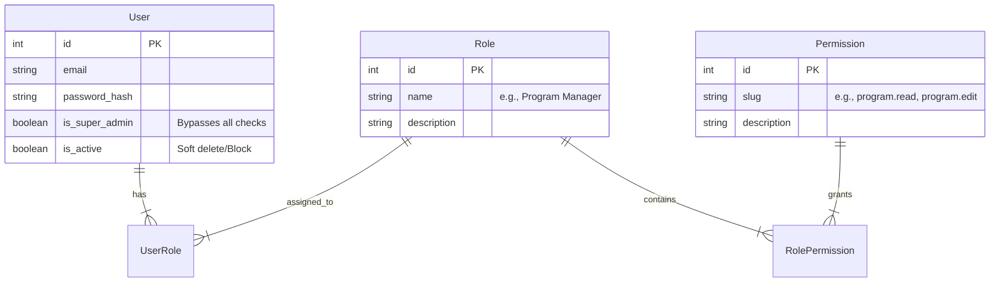

# PRD-007: RBAC & User Management

**Version:** 1.0
**Status:** Draft
**Target:** Backend & Frontend

## 1. Context
The system currently supports basic JWT authentication with a predefined `role` enum (`admin`, `manager`). 
The goal is to implement a **Super Admin** capability to:
1.  Create and manage other users.
2.  Assign granular permissions (access to specific sections and actions).
3.  Control access via an "Admin Panel".

## 2. User Roles & Hierarchy

### 2.1. Super Admin (root)
- **Description**: The omnipotent user (e.g., Vlad).
- **Capabilities**:
    - Manage all Users (Create/Edit/Delete/Block).
    - Manage System Configuration.
    - Full access to all modules (Editor, Sales, Analytics).
    - Cannot be deleted.

### 2.2. Manager (Configurable)
- **Description**: Standard operating user.
- **Capabilities**: Defined by assigned **Groups** or **Direct Permissions**.
- **Examples**:
    - *Program Manager*: Access to "Program Editor" (Read/Write).
    - *Sales Rep*: Access to "Sales" (Read/Write), "Program Editor" (Read Only).

## 3. Data Model (Schema Updates)

To support granular permissions, we will transition from a simple `enum role` to a Permission-based system.

### 3.1. Primitives (Permissions)
Permissions are hardcoded in the codebase (Backend Guards + Frontend Routes) but assigned dynamically in DB.

**Proposed Permission List:**
- `users.manage` (Create/Edit users) -> Super Admin only initially.
- `program.view` (View Schedule)
- `program.edit` (Create/Edit Sessions, Speakers)
- `sales.view` (View Leads)
- `sales.edit` (Manage Deals)

## 4. Interface Design (Frontend)

### 4.1. Admin Panel / Users
**Location**: `/settings/users` (visible only if `users.manage` or `is_super_admin`).

**UI Components**:
1.  **User List Table**:
    - Columns: Name, Email, Role(s), Status (Active/Blocked), Actions (Edit/Delete).
    - "Create User" button.

2.  **Create/Edit User Modal**:
    - **Header**: Login Info (Email, Password, Name).
    - **Rights Block**:
        - Toggle: "Active".
        - **Role Selection**: Dropdown/Tags (e.g., "Manager", "Sales").
        - **Granular Overrides** (Advanced - MVP+): Accordion with Checkboxes.
            - [ ] **Program Editor**
                - [x] View
                - [ ] Edit
            - [ ] **Sales**
                - [x] View
                - [x] Edit

## 5. Implementation Stages

### Stage 1: Foundation (Current Goal)
- [ ] Add `is_super_admin` flag to User table.
- [ ] Create API `POST /users` (Create User).
- [ ] Create API `GET /users` (List Users).
- [ ] Simple Frontend: "Admin Panel" with "Add User" form.
- [ ] Password setting by Admin (temporary) or Invitation Link (ideal).

### Stage 2: RBAC (Future)
- [ ] Implement `Role` and `Permission` tables.
- [ ] UI for managing Role definitions.
