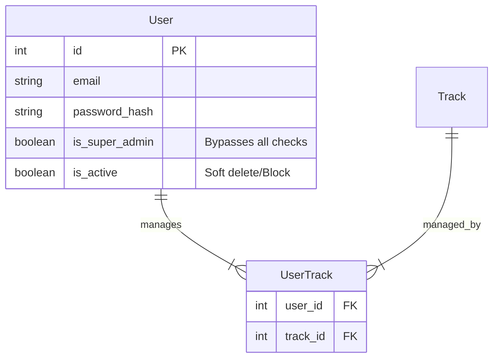

# PRD-007: RBAC & User Management

**Version:** 1.0
**Status:** Draft
**Target:** Backend & Frontend

## 1. Context
The system will transition from basic JWT authentication to **Redis-backed Sessions** to ensure immediate session invalidation when users are blocked.
The goal is to implement a **Super Admin** capability to:
1.  Create and manage other users (Managers).
2.  Assign granular permissions by linking Managers to specific **Tracks**.
3.  Control access via an "Admin Panel" to instantly activate/deactivate users.

## 2. User Roles & Hierarchy

### 2.1. Super Admin (root)
- **Description**: The omnipotent user (e.g., Vlad).
- **Capabilities**:
    - Manage all Users (Create/Edit/Delete/Block).
    - Manage System Configuration.
    - Full access to all modules (Editor, Sales, Analytics).
    - Cannot be deleted.

### 2.2. Manager
- **Description**: Users responsible for specific parts of the program.
- **Capabilities**:
    - Cannot create or manage other users.
    - Assigned to specific **Tracks** (e.g., "Main Stage", "Startup Pitch").
    - Can only edit sessions and data within their assigned Tracks.

## 3. Data Model (Schema Updates)

To support granular permissions, we will transition from basic roles to a Track-based assignment system.

```mermaid
erDiagram
    User ||--|{ UserTrack : manages
    Track ||--|{ UserTrack : managed_by
    
    User {
        int id PK
        string email
        string password_hash
        boolean is_super_admin "Bypasses all checks"
        boolean is_active "Soft delete/Block"
    }

    UserTrack {
        int user_id FK
        int track_id FK
    }
```

### 3.1. Primitives (Permissions)
Permissions are enforced at the API level based on track ownership.
- `users.manage` -> Only SuperAdmin.
- Modifying a Session -> Manager must be assigned to the `Session.Track`.

## 4. Interface Design (Frontend)

### 4.1. Admin Panel / Users
**Location**: `/settings/users` (visible only if `users.manage` or `is_super_admin`).

**UI Components**:
1.  **User List Table**:
    - Columns: Name, Login/Email, Track Assignments, Status (Active/Blocked), Actions (Edit/Delete).
    - "Create User" button.

2.  **Create/Edit User Modal**:
    - **Header**: Login Info (Email, Password, Name). SuperAdmin sets passwords directly.
    - **Rights Block**:
        - Toggle: "Active".
        - **Track Selection**: Multi-select dropdown mapped to Conference Tracks. Managers gain edit rights over these specific tracks.

## 5. Implementation Stages

### Stage 1: Security & Sessions
- [ ] Setup `express-session` and `connect-redis` in NestJS.
- [ ] Migrate Login logic to use Redis sessions instead of JWT.
- [ ] Add `is_super_admin` and `is_active` flags to User table.

### Stage 2: Admin Panel
- [ ] Create `UserTrack` relation in Prisma.
- [ ] Create API `POST /users`, `GET /users`, `PUT /users/:id`, `DELETE /users/:id`.
- [ ] Build Frontend "Admin Panel" with User Grid and Edit Modal.
- [ ] SuperAdmin can set basic passwords and assign managers to tracks.
